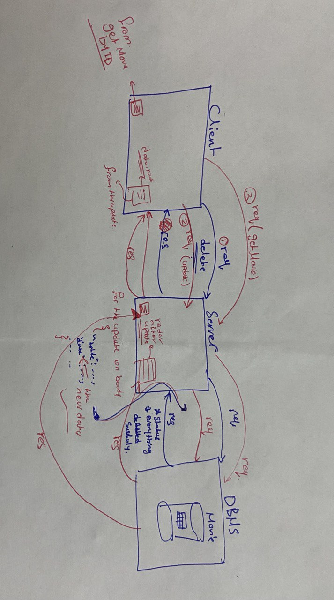

# Movies-Library

# Project Name : Movies-Library
# Project Version: 1.0.0

**Author Name**: Jana Almomani

## WRRC

## Overview
for toady lap i will send do the following:
1. /UPDATE/id create an update request to update comments for a specific movie in the database.
2. /DELETE/id create a delete request to remove a specific movie from your database.
3. /getMovie/id  Create a get request to get a specific movie from the database

## Getting Started
<!-- What are the steps that a user must take in order to build this app on their own machine and get it running? -->
1. clone the url for my repo project on your machine by (git clone git@github.com:JanaAlmomani/Movies-Library.git)
2. run the command (npm i )then on root  put this command (sqlstart)to start DBMS to access our database and then (psql then create a DB bc it's locally )and then do(\c DB_NAME) and (\dt to see the tables and work with it by quary ended by (;)in end you stoped by(sqlstop)
3. then put this command (nodemon) to run the server 
4. copy the url of the route you went to see and put it on the  thunder client and spicetify if it GET,POST,DELETE,PUT 
5. after send the req ,you will git the res

## Project Features
<!-- What are the features included in you app -->
my app give the information about movies represent the information depending on the specific request
in the first i have 6 routes and i can send many requests
for the server,API and access DB by DBMS without any problem.
for today lab i added 3 routes:
1.  /deleteMovie/:id  this req will go to DB (it will delete specific row from the table Depending on the the condition )
2. /updateMovie/:id   this req will go to DB (it will update specific row from the table Depending on the the condition )
3. /getMovies/:id  this req will go to DB (it will get specific row from the table Depending on the the condition )
condition :i mean the id value here