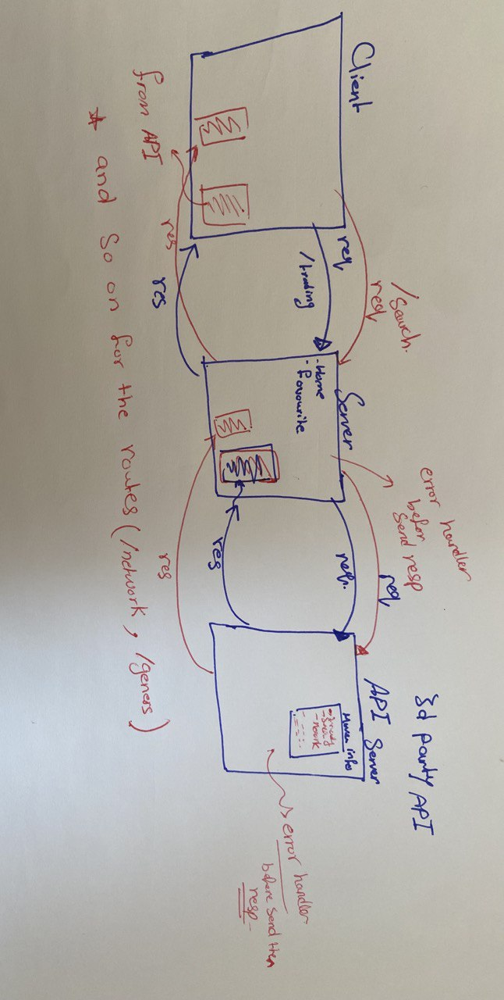

# Movies-Library

# Project Name : Movies-Library
# Project Version: 1.0.0

**Author Name**: Jana Almomani

## WRRC

## Overview
for toady lap i will send get requests to a 3rd party API and display data
then i will create GET request to the 3rd party API for these endpoints:
1. /trending 
2. /search
3. two from my choise
4. Handler the error

## Getting Started
<!-- What are the steps that a user must take in order to build this app on their own machine and get it running? -->
 1.clone the url for my repo project on your machine by (git clone git@github.com:JanaAlmomani/Movies-Library.git)
2.then put this command (nodemon) to run the server 
4.copy the url of the route you went to see and put it on the browser
5.and so on for other routes

## Project Features
<!-- What are the features included in you app -->
my app give the information about movies represent the information depending on the specific request
in the first i have 6 routes and i can send many requests
for the server without any problem .
for today lab i added 4 routes:
1. (/trending)after put the correct url(http://localhost:3000/trending) on the browser and put enter it will send req for the server and then to API and if everything good the API wil send the res to my server and then the server will send the res on the browser(client) then show(Get)  the info regarding trending moviesbc we have function errorHandler.

2. (/search)after put the correct url(http://localhost:3000/search) on the browser and put enter it will send req for the server and then to API and if everything good the API wil send the res to my server and then the server will send the res on the browser(client) then show the info regarding the movies you searched and if there any error on these process it will represent for you bc we have function errorHandler.

3. (/genres)after put the correct url(http://localhost:3000/genres) on the browser and put enter it will send req for the server and then to API and if everything good the API wil send the res to my server and then the server will send the res on the browser(client) then show(Get) the info regarding the list of official genres for movies. and if there any error on these process it will represent for you bc we have function errorHandler .

4. (/network)after put the correct url(http://localhost:3000/network) on the browser and put enter it will send req for the server and then to API and if everything good the API wil send the res to my server and then the server will send the res on the browser(client)then  show(Get) the info regarding the details of a network and if there any error on these process it will represent for you bc we have function errorHandler .

 in the end we have function errorHandler to check the process for the req and if everything good we send the res if not we send res from errorHandler and will show the proplem for you .