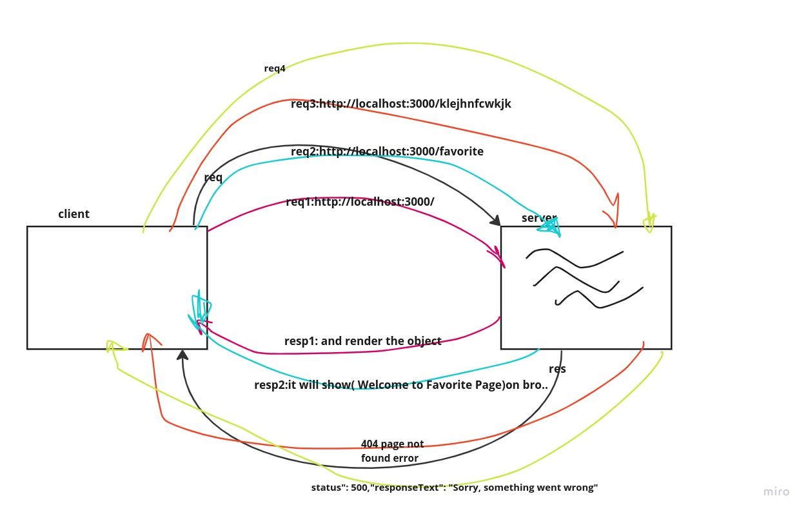

# Movies-Library

# Project Name : Movies-Library
# Project Version: 1.0.0

**Author Name**: Jana Almomani

## WRRC
Add an image of your WRRC here

## Overview
app about Movies 
## Getting Started
<!-- What are the steps that a user must take in order to build this app on their own machine and get it running? -->
 i think to get the app on their own machine they  have to copy my SSH key for the app and  then clone it in his device and run it eassay on their browser.

## Project Features
<!-- What are the features included in you app -->
 my app give the information about movies
 represent the title of the movie,movie image and overview obout it
 helpful bc we need this info if we want to see any movies 
and in this lap we sends req.. to the servier and its done successfully.

