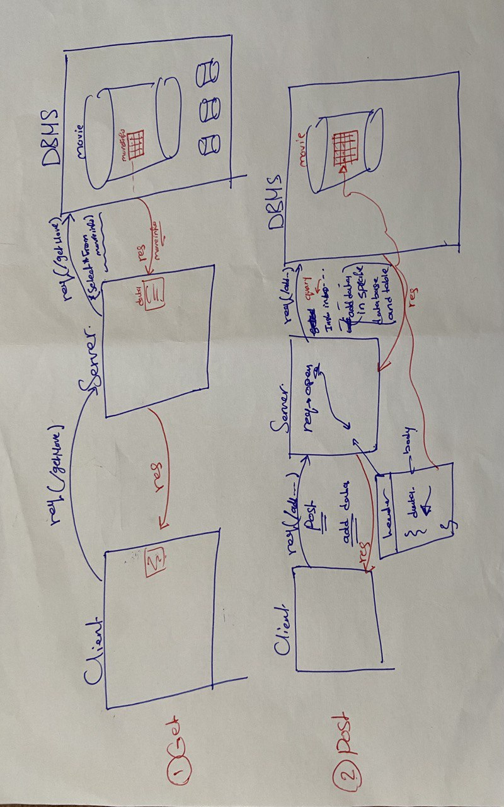

# Movies-Library

# Project Name : Movies-Library
# Project Version: 1.0.0

**Author Name**: Jana Almomani

## WRRC

## Overview
for toady lap i will send get requests to Database and display data
then create post request to add data 
1. /getMovies
2. /addMovieInfo

## Getting Started
<!-- What are the steps that a user must take in order to build this app on their own machine and get it running? -->
1. clone the url for my repo project on your machine by (git clone git@github.com:JanaAlmomani/Movies-Library.git)
2. put this command (sqlstart)to start DBMS to access our database and in end you stoped by(sqlstop)
3. then put this command (nodemon) to run the server 
4. copy the url of the route you went to see and put it on the browser just the Get
5. but the Post send the req using thunder client to write the data inside the body
6. if you want to see the Database you can by run this command(psgl,and then \l to see all database in DBMS)
## Project Features
<!-- What are the features included in you app -->
my app give the information about movies represent the information depending on the specific request
in the first i have 6 routes and i can send many requests
for the server without any problem .
for today lab i added 2 routes:
1.  /getMovies it will return the data that inside the table in our database after added data using the (post) by using specific query .
2. /addMovieInfo to add data inside the table in our database it will send the req to the DBMS by using specific query and will write the data inside the body and then make the res by render these data into table.